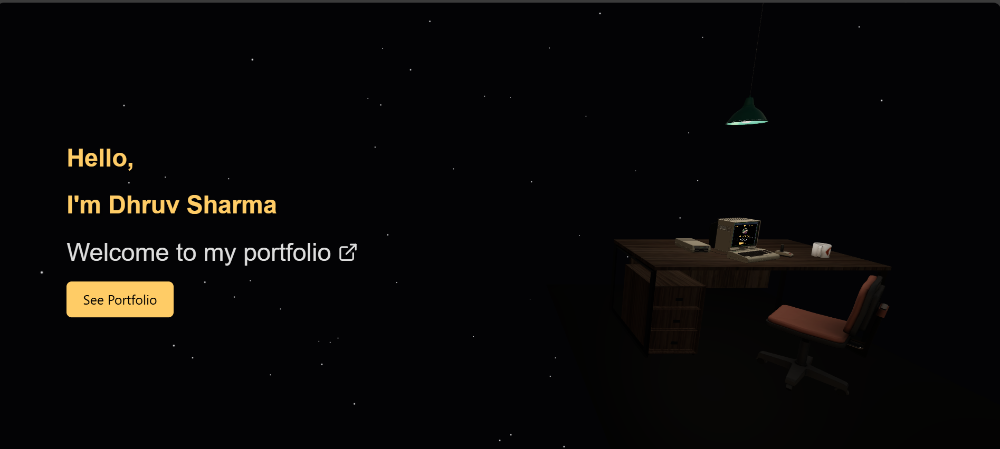
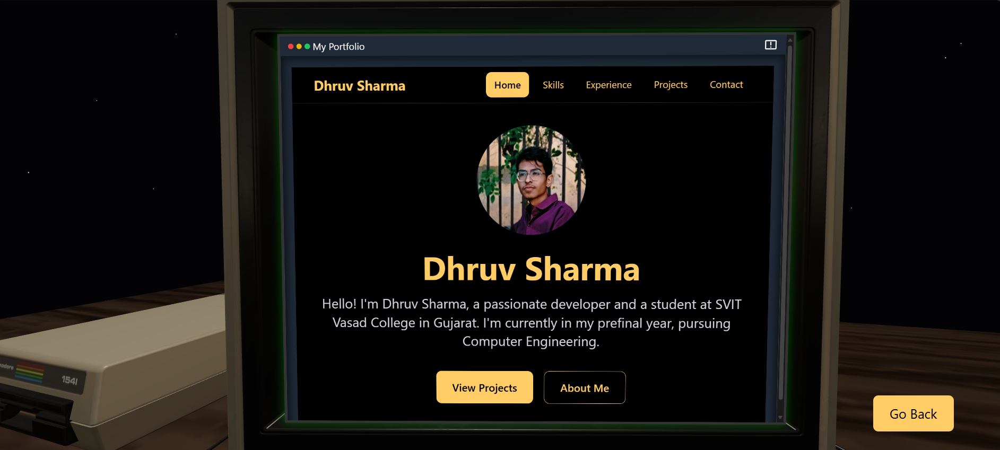
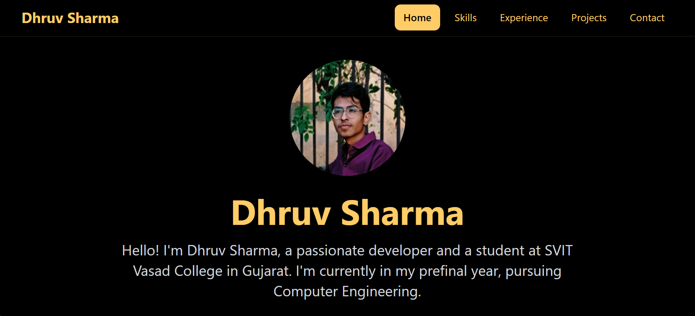

# Portfolio Website

Welcome to my personal portfolio website! 🚀 This project showcases my skills, projects, and expertise, built with modern web technologies.

## 🌟 Features

- **Interactive 3D Elements**: Powered by [Three.js](https://threejs.org/), adding dynamic visuals.
- **Modern Tech Stack**: Utilizes React for efficient UI rendering and state management.
- **Projects Showcase**: Displays some of my best work with descriptions and live links.
- **Smooth Animations**: Engaging animations for an enhanced user experience.

---

## 💻 Tech Stack

- **Frontend**: React, SCSS
- **3D Graphics**: Three.js
- **Hosting**: [Vercel](https://vercel.com/)

---

## 📸 Screenshots

### 3D Scene


### Monitor Screen


### Portfolio


---

## 🚀 Setup Instructions

Follow these steps to run the portfolio locally:

1. **Clone the Repository**:
   ```bash
   git clone https://github.com/MrD0511/3D_portfolio_react.git
   cd 3D_portfolio_react
   ```
2. **Install dependencies**:
   ```bash
   npm install
   ```
3. **Run the Development Server**:
   ```bash
   npm run dev
   ```
4. **Open your browser and navigate to http://localhost:5173.**

---

## 📄 License
[MIT License](./LICENSE) © 2025 Dhruv Sharma

---

## 📧 Contact

Feel free to reach out via Email or connect on LinkedIn.

[Mail](mailto://sharmadhruv00005@gmail.com) |
[Linkedin](https://www.linkedin.com/in/dhruvsharma005)

---

## ⭐ Don’t forget to give this repo a star if you found it helpful!

```bash
Let me know if you'd like to tweak or add anything! 😊
```
